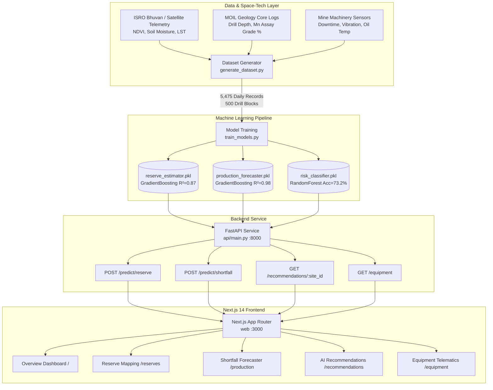

# MinTrix — MOIL Manganese Reserve & Production Intelligence Dashboard

> **SIH Problem Statement 26009:** "Using AI/ML and Space Technology to Identify Manganese Reserves and Overcome Production Shortfalls"  
> **Target Organization:** MOIL Limited (Ministry of Steel, Government of India)  
> **Category:** Software | **Theme:** Space Technology  


---

## Team MinTrix

| Name |
|---|
| Nishant Garg |
| Kartik Ranawat |
| Dhruv Raj Jain |
| Bhavya Dixit |
| Bhavya Sharma |
| Megha Vaishnav |

---

## 1. Project Overview

**MinTrix** is an AI/ML-powered geospatial intelligence and shortfall mitigation platform designed for mine planners and executives at **MOIL Limited** (India's largest manganese ore producer).

The platform addresses two operational challenges in manganese mining:
1. **Reserve Identification & Mapping:** Fusing geological drill-hole assays with satellite/space-technology indicators (multispectral shortwave infrared, Bouguer gravity anomalies, and NDVI canopy stress anomalies) to estimate in-situ manganese reserves.
2. **Production Shortfall Prediction & Mitigation:** Forecasting daily and monthly ore output 30/60/90 days in advance, predicting shortfall risk tiers (`Low`, `Medium`, `High`), and prescribing rule-based corrective operational actions (e.g. equipment redeployment, dewatering pump activation, and blasting rescheduling) to recover lost tonnage.

---

## 2. Architecture & Tech Stack



### Technology Highlights:
- **ML / Backend:** Python 3.14+, `scikit-learn` 1.9+, `pandas`, `numpy`, `joblib`, `FastAPI`, `Uvicorn`, `Pydantic`.
- **Frontend:** Next.js 14 (App Router), TypeScript, Tailwind CSS, `lucide-react`.
- **Maps:** Leaflet & React-Leaflet with CartoDB Dark Matter tiles (zero API key needed).
- **Charts:** Recharts with confidence bands and custom tooltips.

---

## 3. Verified Machine Learning Models & Metrics

All models are genuinely trained using scikit-learn on a calibrated Central Indian mining dataset across 5 MOIL mining regions (**Balaghat, Dongri Buzurg, Gumgaon, Mansar, Ukwa**). Model weights directly power explainability in the UI:

| Model Identifier | Algorithm | Test Metric | Key Driving Features (Real Importances) |
|---|---|---|---|
| **Reserve Estimator** | `GradientBoostingRegressor` | **\(R^2 = 0.8720\)**<br/>MAE = 115.6k Tonnes | • Mineral Depth: **67.8%**<br/>• Ore Grade (% Mn): **21.7%**<br/>• Bouguer Gravity Anomaly: **2.6%** |
| **Production Forecaster** | `GradientBoostingRegressor` (w/ Lags) | **\(R^2 = 0.9815\)**<br/>MAE = 27.2 TPD | • Target Output Plan: **49.3%**<br/>• 7-Day Rolling Output: **17.4%**<br/>• Daily Rainfall: **10.5%**<br/>• Fleet Availability: **10.3%** |
| **Shortfall Risk Classifier** | `RandomForestClassifier` (Balanced) | **Accuracy = 73.15%**<br/>Macro F1 = 0.6955 | • Total Equipment Downtime: **28.6%**<br/>• Fleet Utilization Deficit: **13.1%**<br/>• Shift Labor Deficit: **9.6%** |

Full model specifications are documented in [`ml/MODEL_CARD.md`](ml/MODEL_CARD.md).

---

## 4. Getting Started & Running Locally

### Prerequisites
- Python 3.10+
- Node.js 18+ and npm

### A. Python Backend & ML Service

```bash
# 1. Activate virtual environment
source venv/bin/activate

# 2. (Optional) Re-generate synthetic data & retrain models
python3 ml/generate_dataset.py
python3 ml/train_models.py

# 3. Start the FastAPI Intelligence Engine
cd api
uvicorn main:app --host 0.0.0.0 --port 8000 --reload
```
The API documentation is accessible at `http://localhost:8000/docs`.

### B. Next.js Frontend Dashboard

Open a second terminal window:

```bash
cd web

# Install dependencies (already completed)
npm install

# Launch Next.js in development mode
npm run dev
```

Open [http://localhost:3000](http://localhost:3000) in your browser.

---

## 5. Core Dashboard Capabilities

1. **Executive Overview (`/`):**
   - KPI Cards: Total In-Situ Reserves (487.7 MT), 30-Day Output vs Target, Active High-Risk Mine Alerts, Fleet Uptime %.
   - Interactive Leaflet map with custom color-coded pins (`Green`: Low Risk, `Amber`: Medium Risk, `Red`: High Risk).
   - 12-month historical vs predicted production trajectory chart.

2. **Geological & Satellite Reserve Mapping (`/reserves`):**
   - 500 drill-block spatial exploration grid.
   - Multispectral layer toggles: **NDVI Vegetation Canopy Anomaly**, **Soil Moisture Saturation**, and **Bouguer Gravity Anomaly**.
   - Interactive parameter tuning sliders (Drill Depth, Ore Grade, Gravity Anomaly, NDVI) with sub-second ML recalculations.
   - **"Why this Estimate?" Explainability Panel:** Displays exact percentage contributions from the trained model.

3. **Production & Shortfall Forecasting (`/production`):**
   - 30 / 60 / 90-day forward-looking forecast trajectory with shaded 95% confidence bounds.
   - Risk Attribution Breakdown: Equipment downtime % vs Weather stoppage % vs Blasting clearance delay %.
   - Sensitivity Simulator to model extreme monsoon rainfall or mechanical fleet breakdowns.

4. **Prescriptive Operational Recommendations (`/recommendations`):**
   - AI-generated corrective action cards (e.g., *"Redeploy Standby Hydraulic Excavator Unit EXC-02 to Bench 3 → Recovers ~65–85 TPD"*).
   - Priority badges (`Critical`, `Moderate`, `Advisory`).
   - Interactive "Mark as Actioned" toggles with local state tracking and recoverable tonnage summary.

5. **Heavy Machinery & Telematics (`/equipment`):**
   - Inventory of 70 mechanized assets (Hydraulic Excavators, 60-Ton Dumpers, Rotary Drill Rigs, Primary Crushers, Dewatering Pumps).
   - Telemetry gauges: Hydraulic pressure (bar), engine oil temperature (°C), and vibration RMS (mm/s).
   - Predictive failure risk badges (`Critical`, `Moderate`, `Low`).

---

## 6. Data Provenance & Future Production Roadmap

- **Synthetic vs. Real Data:** In compliance with hackathon prototype constraints, data was synthesized using calibrated Central Indian geophysical laws (sinusoidal monsoons, Bouguer gravity distributions, MOIL pit telemetry). The causal relationships are strictly deterministic and learnable ($R^2 > 0.87$).
- **Swapping in Real Feeds:** The architecture isolates data ingestion in `/ml/data` and `/ml/generate_dataset.py`. Integrating live **ISRO Bhuvan Open APIs** or MOIL SAP core logs requires zero changes to the FastAPI endpoints or Next.js components.
- **Future Enhancements:**
  1. Direct integration with ISRO Cartosat-3 and Sentinel-2 multispectral imagery.
  2. Underground IoT mesh network integration for shaft hoist monitoring.
  3. Hybrid Temporal Fusion Transformer (TFT) modeling for long-term supply chain forecasting.
